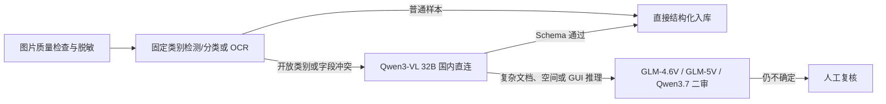

# VLM Price 国内版：国产视觉模型真实报价与落地指南

这是一份只讨论**中国模型厂商、国内直连与私有化路线**的补充版本。目标仍然是把 token 计费转换成直观问题：

> 识别一张 1024×1024、约 1MB、只有一个物品的图片，国产 VLM 实际要多少钱？真正上线时应该怎么选？

## 先说清“完全国内”的定义

“模型由中国团队研发”不等于“请求链路和数据存储在境内”。一个完整国内方案至少要同时确认：

1. 模型提供方与合同主体符合采购要求；
2. API 接入地域、推理地域、日志与对象存储地域满足业务要求；
3. 图片没有经过 OpenRouter、海外云或海外 CDN；
4. 数据保留、训练使用、日志脱敏和删除策略已经通过合同与控制台配置确认；
5. 若要求物理隔离，则使用国内云专属实例或自建推理，而不是公共聚合 API。

本项目通过 OpenRouter 做统一横向实测，是为了得到同图、同提示词下的效果和费用尺子。**OpenRouter 实测不是国内生产链路证明，也不是国内厂商直连接口报价。**

## 国产模型实测排行

统一图片为单个红色陶瓷马克杯，统一要求返回简体中文短 JSON。人民币按 `$1=¥7.20` 换算。

| 排名 | 模型 | 结果 | OpenRouter 实测/张 | 1千张 | 延迟 | 实际建议 |
|---:|---|---|---:|---:|---:|---|
| 1 | Qwen3.7 Flash | 重试正确 | ¥0.00079 | ¥0.79 | 19.84s | 目录价极低，但 541 个推理 token；国内直连应关闭思考并启用结构化输出 |
| 2 | Qwen3 VL 32B Instruct | 正确 | ¥0.00091 | ¥0.91 | 4.95s | **简单识别首选**，专用 VLM、输出短、可私有化 |
| 3 | Qwen3 VL 8B Instruct | 正确 | ¥0.00104 | ¥1.04 | 3.75s | 轻量私有化候选，但本次目录价不如 32B |
| 4 | Xiaomi MiMo V2.5 | 正确 | ¥0.00134 | ¥1.34 | 10.93s | 聚合器表现可用；本次由 Parasail 路由，不能视为国内链路 |
| 5 | Qwen3 VL 235B A22B Instruct | 正确 | ¥0.00181 | ¥1.81 | 5.18s | 复杂视觉候选；简单物品上没有必要上大模型 |
| 6 | MiniMax M3 | 正确 | ¥0.00222 | ¥2.22 | 4.81s | OpenRouter 支持图片；国内直连前需复核官方当前多模态型号与计费 |
| 7 | Step 3.7 Flash | 正确 | ¥0.00249 | ¥2.49 | 5.70s | JSON 外包 Markdown；国内生产应直连阶跃平台 |
| 8 | GLM-4.6V | 正确 | ¥0.00381 | ¥3.81 | 8.53s | 文档、视频、GUI 与长上下文比单物品分类更有价值 |
| 9 | Seed 2.1 Turbo | 正确 | ¥0.00806 | ¥8.06 | 10.11s | 国内生产优先火山方舟；简单分类性能过剩 |
| 10 | GLM-5V Turbo | 重试正确 | ¥0.01615 | ¥16.15 | 24.98s | 多模态 Coding/Agent 定位，不适合当普通分类器 |
| 11 | Kimi K3 | 正确 | ¥0.04588 | ¥45.88 | 13.25s | 旗舰通用多模态与长任务模型，单物品识别明显过剩 |

本次国内补充新增 8 个模型，并对 Qwen3.7 Flash 重试一次；新增测试的 OpenRouter 账单合计 **$0.009294070**。表中“每张”仍采用拿到正确可见答案的单次请求费用，失败/截断首轮不会被摊薄隐藏。

### 价格为什么能差 58 倍

这 11 个模型都能看懂同一个杯子，但产品定位完全不同：

- Qwen3-VL Instruct 是专用视觉理解模型，短输出时没有额外推理负担。
- Qwen3.7、MiMo、MiniMax、Step、Seed、Kimi 等通用/Agent 模型可能先进行内部推理；即使答案只有几十字，输出账单也可能包含数百个 reasoning token。
- GLM-5V Turbo 和 Kimi K3 面向复杂多模态、Coding、工具与长任务，用它们做固定物品分类相当于“开大型工程车送一杯咖啡”。
- 聚合器可能路由到不同供应商；模型目录最低价不保证就是最终路由价。

## 国内落地推荐矩阵

| 业务场景 | 首选路线 | 备选 | 不建议 |
|---|---|---|---|
| 固定几十/几百个商品类别 | 传统分类/检测模型；VLM 只兜底 | Qwen3-VL 8B/32B | 所有图片直接上旗舰推理模型 |
| 开放世界物品识别 | Qwen3-VL 32B，百炼直连 | GLM-4.6V | 把模型自报 confidence 当真实概率 |
| 中文票据/表单抽取 | OCR/版面分析 + VLM 校验 | Qwen3.7 非思考结构化输出、GLM-OCR/GLM-4.6V | 直接让 VLM 输出长篇解释 |
| 电商商品属性与图文审核 | Qwen3-VL/Qwen3.7 | GLM-4.6V、Seed | 单图使用 Kimi K3 等旗舰长任务模型 |
| UI 截图、GUI Agent、截图转代码 | GLM-5V Turbo、Step 3.7 | Qwen3.7 Plus | 用传统 OCR 独立承担空间推理 |
| 长文档/PPT/视频理解 | GLM-4.6V/5V、Qwen3.7、Kimi K3 | Seed | 把每页单独无缓存重复发送 |
| 数据严格不出专网 | Qwen3-VL 开源权重私有化 | 国内云专属实例 | OpenRouter 或不明确地域的公共端点 |

## 国内 API 与私有化怎么选

### 国内厂商直连 API

适合快速上线、弹性流量和不想维护 GPU 的团队：

- 阿里云百炼：Qwen3.7、Qwen3.6、Qwen3-VL 系列原生支持视觉和结构化输出；官方给出的 Qwen3 系列图像 token 估算约为 `缩放后高×宽/(32×32)+2`。1024×1024 理论视觉部分约 1026 token，与本项目 Qwen 实测输入约 1070 token 基本一致。
- 智谱 BigModel：GLM-4.6V、GLM-5V Turbo、GLM-OCR 覆盖通用视觉、长文档、GUI/Coding 和轻量 OCR 等不同路线。
- 火山方舟：Seed/豆包系列由平台按输入与输出 token 计费；应在控制台固定模型版本和推理地域。
- Kimi API：Kimi K3 是原生视觉旗舰，适合长程知识工作；做简单图片分类成本明显过剩。
- 阶跃开放平台：官方视觉模型支持 URL/Base64，多图总大小与张数有限制；生产应使用正式模型而不是 Model Lab 体验模型。
- MiniMax：官方平台提供图片理解工具与多模态能力，但具体文本模型是否原生接收图片会随产品线变化；接入前以 API 模型清单和 `supports_image_in` 为准。

### 开源模型私有化

适合稳定大流量、数据不出域、可接受 GPU 运维的团队：

- 8B/小参数模型：部署门槛较低，适合类别识别、简单 OCR 校验和边缘/单机服务。
- 30B/32B：通常是效果、吞吐与成本的均衡档，本次 Qwen3 VL 32B 也表现最好。
- 235B/MoE/旗舰模型：需要更复杂的量化、并行与调度；如果任务只是“识别一个杯子”，很难通过业务收益覆盖基础设施复杂度。

私有化成本不能用 API token 单价直接比较，应以每秒图片数、GPU 小时成本、峰值利用率、冗余、运维与模型升级成本计算。低利用率时，API 往往更便宜；高且稳定的吞吐、严格数据边界或专门微调需求，私有化才更有意义。

## 基于实际业务的关键判断

### 1. 固定类别优先传统 CV，不要迷信 VLM

如果类别集合固定、训练样本充足，分类/检测模型通常吞吐更高、输出更稳定，也更容易校准置信度。VLM 的优势是开放世界理解、零样本类别、复杂指令和多字段联合抽取。

### 2. OCR 与 VLM 最好分层

票据、证照、合同和表格建议采用：图像质量检测 → OCR/版面分析 → VLM 结构化校验 → 规则引擎。这样比让大 VLM 从头输出全文更容易定位错误、控制费用和满足审计。

### 3. 思考模式不是默认增益

本次 Qwen3.7 Flash 首次把 300 个输出 token 全部用于内部推理，未产生可见答案；GLM-5V Turbo 首轮也发生类似情况。简单抽取应关闭思考，复杂空间/图表推理才按需开启，并把 reasoning token 纳入预算。

### 4. JSON 仍需强校验

Step 3.7 和部分模型会在 JSON 外加 Markdown fence；模型也可能漏字段、改字段名或输出无法解析内容。生产必须使用 JSON Schema、白名单、类型检查和有限重试。

### 5. 自报置信度不是可靠概率

主报告中的 Mistral 把杯子错判为塑料桶，置信度仍为 0.98。国内模型同样不能直接把 `confidence` 用作自动放行阈值；需要用真实验证集做校准，并结合多模型一致性和业务规则。

## 最务实的国内生产方案

这条链路把便宜、确定性的工具放在前面，把 VLM 用在它真正擅长的开放语义与复杂推理上。

## 上线前验收清单

- 使用 200～1000 张带人工真值的国内业务图片，不以公开 demo 图代替。
- 分层覆盖中文小字、反光、模糊、遮挡、旋转、多物体、印章、手写体和应拒答样本。
- 记录准确率、关键类别召回率、JSON 合法率、P50/P95 延迟、失败率、重试后成本。
- 在合同和控制台确认推理地域、日志地域、数据保留、训练使用、删除机制和子处理方。
- 固定模型版本；先灰度再升级，不直接跟随 `latest`。
- 限制图片像素和输出 token；简单任务关闭思考。
- 设置 QPS、单请求费用、日预算和异常 token 告警。
- 任何 API key 只放在服务端密钥系统，不进客户端、Git 或日志。

## 数据文件

- [`data/domestic-benchmark-results.csv`](data/domestic-benchmark-results.csv)：11 个国产多模态模型的统一实测。
- [`data/domestic-openrouter-pricing-snapshot.json`](data/domestic-openrouter-pricing-snapshot.json)：所测国产模型的 OpenRouter 当日价格快照。
- [`docs/06-国内VLM实际选型与落地.md`](docs/06-国内VLM实际选型与落地.md)：国内路线的详细口径、限制和供应商说明。

## 官方参考

- [阿里云百炼：视觉理解](https://help.aliyun.com/zh/model-studio/vision-model)
- [阿里云百炼：视觉 token 与分辨率](https://help.aliyun.com/zh/model-studio/vision/)
- [智谱：GLM-4.6V-Flash](https://docs.bigmodel.cn/cn/guide/models/free/glm-4.6v-flash)
- [智谱：GLM-5V-Turbo](https://docs.bigmodel.cn/cn/guide/models/vlm/glm-5v-turbo)
- [火山方舟文档](https://www.volcengine.com/docs/82379/?lang=zh)
- [Kimi API 概览](https://www.kimi.com/help/kimi-api/api-overview)
- [阶跃星辰：视觉理解模型](https://platform.stepfun.com/docs/zh/guides/models/vision)
- [MiniMax：图片理解工具](https://platform.minimaxi.com/docs/token-plan/mcp-guide)

> 所有供应商功能、单价、免费额度和合规选项都可能变化。本文的 OpenRouter 费用仅用于同条件横向比较；国内采购报价与数据边界必须以厂商最新控制台、合同和实际 API 账单为准。
