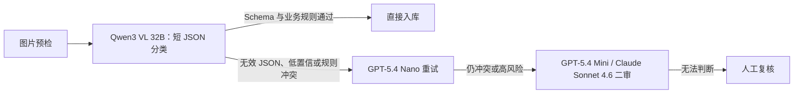

# VLM Price：图片识别模型真实报价与 OpenRouter 实测

把难以理解的“每百万 token 单价”，转换成业务人员能直接使用的报价口径：

> **识别一张 1024×1024、约 1MB、包含单个物品的图片，到底多少钱？**

本项目通过 OpenRouter 对 13 个视觉语言模型（VLM）执行统一图片识别请求，记录模型答案、原生输入/输出 token、实际账单、供应商、延迟和失败重试，并提供逐项交叉验算。

数据快照与实测日期：**2026-08-14**。

> 需要只包含国产模型、国内厂商直连和私有化路线的版本，请直接阅读 **[`README-国内版.md`](README-国内版.md)**。该补充新增 8 个国产多模态模型实测，合并后共比较 11 个国产模型，并明确区分“中国模型”与“境内数据链路”。


## 结论速览

统一任务：识别图中的单个主要物品，返回 `object / color / material / count / confidence` 短 JSON。人民币按固定预算汇率 `$1 = ¥7.20` 换算。

| 选择 | 模型 | 实测美元/张 | 预算人民币/张 | 1 千张 | 结果 | 推荐度 |
|---|---|---:|---:|---:|---|---:|
| 极致性价比 | `qwen/qwen3-vl-32b-instruct` | $0.000126 | ¥0.00091 | ¥0.91 | 正确 | ★★★★★ |
| 省心上线 | `openai/gpt-5.4-nano` | $0.000290 | ¥0.00209 | ¥2.09 | 正确 | ★★★★★ |
| Google 生态 | `google/gemini-3.5-flash-lite` | $0.000420 | ¥0.00302 | ¥3.02 | 正确 | ★★★★☆ |
| 更复杂图片 | `openai/gpt-5.4-mini` | $0.001083 | ¥0.00780 | ¥7.80 | 正确 | ★★★★☆ |
| 高价二审 | `anthropic/claude-sonnet-4.6` | $0.004656 | ¥0.03352 | ¥33.52 | 正确 | ★★★☆☆ |

关键发现：

- 对单物品识别，正确请求的模型费约为 **¥0.00091～¥0.03352/张**。
- “参数更小”不保证更便宜：本次 Qwen3 VL 32B 的目录价与实付价均低于 8B。
- Mistral Small 4 将陶瓷杯高置信度误判成塑料桶；低价不能替代业务数据集评测。
- NVIDIA 免费视觉模型两次请求分别遇到 502 和超时；免费端点不等于生产 SLA。
- OpenRouter 自动路由可能改变供应商与实际价格。本次 Llama 4 Maverick 的 Novita 实付价比目录起价估算高约 34.4%。
- 账号测试前后费用增量为 **$0.014937626**，与所有 API 响应中的 `usage.cost` 求和完全一致。

## 为什么“1MB 图片”不是计费心智

VLM 通常不会按上传文件的 MB 数线性计费。图片会按照模型各自的缩放、切片或视觉 token 规则转换为输入 token。因此：

- 同为 1024×1024，1MB PNG 与 200KB JPEG 的模型费通常接近；
- 降低文件压缩体积主要节省带宽，不一定节省视觉 token；
- 真正影响费用的是模型、分辨率、视觉 token、输出长度、内部推理 token 和实际路由供应商；
- 最可靠的成本依据是响应中的 `usage.cost`，而不是只根据公开 token 单价猜测。

## 完整实测表

| 模型 | 有效/尝试 | 结果 | 输入+输出 token | 成功请求费用 | 延迟 | 推荐度 |
|---|---:|---|---:|---:|---:|---:|
| NVIDIA Nemotron Nano 12B V2 VL Free | 0/2 | 502；重试超时 | — | $0 | >120s | ★☆☆☆☆ |
| Qwen3 VL 32B Instruct | 1/1 | 正确 | 1070+36 | $0.000126256 | 4.95s | ★★★★★ |
| Qwen3 VL 8B Instruct | 1/1 | 正确 | 1070+43 | $0.000144755 | 3.75s | ★★★★☆ |
| Amazon Nova Lite 1.0 | 1/1 | 正确 | 2645+35 | $0.000167100 | 11.99s | ★★★★☆ |
| Mistral Small 4 | 1/1 | **误判为塑料桶** | 1457+35 | $0.000239550 | 4.92s | ★★☆☆☆ |
| GPT-5.4 Nano | 1/1 | 正确 | 1270+29 | $0.000290250 | 3.38s | ★★★★★ |
| Gemini 3.5 Flash Lite | 1/1 | 正确 | 1125+33 | $0.000420000 | 6.95s | ★★★★☆ |
| Gemini 3.7 Flash | 1/2 | 重试正确 | 1124+79 | $0.000569625 | 6.10s | ★★★★☆ |
| Llama 4 Maverick | 1/1 | 正确 | 2512+35 | $0.000707990 | 3.76s | ★★★☆☆ |
| GPT-5.4 Mini | 1/1 | 正确 | 1270+29 | $0.001083000 | 4.12s | ★★★★☆ |
| Claude Haiku 4.5 | 1/1 | 正确 | 1417+53 | $0.001682000 | 7.71s | ★★★☆☆ |
| GLM 5V Turbo | 1/2 | 重试正确 | 1339+159 | $0.002242800 | 24.98s | ★★★☆☆ |
| Claude Sonnet 4.6 | 1/1 | 正确 | 1417+27 | $0.004656000 | 4.20s | ★★★☆☆ |

> 这是单张标准商品图的接入与计费冒烟测试，不是统计学视觉排行榜。生产选型必须使用带人工真值的业务图片集复测。

## 使用热度，不编造“用户人数”

OpenRouter 不公开每个模型的独立用户人数。项目改用可审计的 30 日 token 总量作为使用热度代理。公开排行榜 API 只包含每天 Top 50 模型，因此“未出现”不能解释为无人使用。

数据范围为 2026-07-15 至 2026-08-13：

| 模型 | 30 日 OpenRouter token | 解释 |
|---|---:|---|
| Gemini 3.5 Flash Lite | 572.7B | 高热度代理，不等于用户数 |
| GPT-5.4 Nano | 488.6B | 高热度代理，不等于用户数 |
| GPT-5.4 Mini | 463.0B | 高热度代理，不等于用户数 |
| 其他本次模型 | 未进入/未出现在公开 Top 50 数据 | 不能推断为无人使用 |

引用口径：Source: OpenRouter (openrouter.ai/rankings), as of 2026-08-14T08:03:05.065Z.

## 成本计算

```text
单张美元 = 输入 token × 输入美元单价/token
         + 输出 token × 输出美元单价/token
         + 按图或按请求附加费

单张人民币 = 单张美元 × 7.20
批量预算 = 单张人民币 × 图片数量
```

示例，Qwen3 VL 32B：

```text
1070 × $0.104 / 1,000,000
+ 36 × $0.416 / 1,000,000
= $0.000126256/张
= ¥0.0009090432/张
≈ ¥0.91/千张
```

OpenRouter 购买 credits 时还可能产生支付手续费；报告将其与模型原始推理费分开，避免口径混淆。

## 推荐生产路由



上线时建议记录 `model`、`provider`、输入/输出 token、`usage.cost`、延迟、业务结果和重试次数。为每次请求设置超时、最多一次同模型重试和总预算上限。

## 项目结构

```text
.
├── README.md
├── README-国内版.md
├── SECURITY.md
├── assets/
│   └── benchmark-mug-1024.png
├── data/
│   ├── benchmark-results.csv
│   ├── domestic-benchmark-results.csv
│   ├── domestic-openrouter-pricing-snapshot.json
│   ├── openrouter-model-pricing-snapshot.json
│   └── openrouter-usage-snapshot.json
└── docs/
    ├── 01-完整报价表.md
    ├── 02-交叉验算.md
    ├── 03-测试方法与原始结果.md
    ├── 04-选型与上线建议.md
    ├── 05-来源与口径.md
    └── 06-国内VLM实际选型与落地.md
```

## 数据与复核

- [`data/benchmark-results.csv`](data/benchmark-results.csv)：可导入 Excel 或数据库的统一结果。
- [`data/openrouter-model-pricing-snapshot.json`](data/openrouter-model-pricing-snapshot.json)：13 个所测模型的当日目录价格快照。
- [`data/openrouter-usage-snapshot.json`](data/openrouter-usage-snapshot.json)：公开排行榜原始数据子集。
- [`data/domestic-benchmark-results.csv`](data/domestic-benchmark-results.csv)：11 个国产多模态模型的统一实测与国内生产备注。
- [`README-国内版.md`](README-国内版.md)：国产模型、国内直连、私有化与实际业务选型的独立完整版本。
- [`docs/02-交叉验算.md`](docs/02-交叉验算.md)：逐模型 token × 单价计算及路由价差。
- [`docs/03-测试方法与原始结果.md`](docs/03-测试方法与原始结果.md)：提示词、参数、答案、失败、重试和账号级费用核对。

## 官方来源

- [OpenRouter Models API](https://openrouter.ai/api/v1/models)
- [模型目录与计价字段](https://openrouter.ai/docs/guides/overview/models)
- [Usage Accounting](https://openrouter.ai/docs/cookbook/administration/usage-accounting)
- [30 日排行榜数据 API](https://openrouter.ai/docs/api/api-reference/datasets/get-rankings-daily)
- [多模态输入说明](https://openrouter.ai/docs/guides/overview/multimodal/overview)
- [费用与 credits 手续费 FAQ](https://openrouter.ai/docs/faq)

## 复现实验

请求采用 OpenRouter 的 OpenAI-compatible Chat Completions 格式：

```json
{
  "model": "qwen/qwen3-vl-32b-instruct",
  "messages": [{
    "role": "user",
    "content": [
      {
        "type": "text",
        "text": "Identify the single main object. Return ONLY compact JSON with keys object, color, material, count, confidence."
      },
      {
        "type": "image_url",
        "image_url": {"url": "data:image/png;base64,<BASE64>"}
      }
    ]
  }],
  "temperature": 0,
  "max_tokens": 120
}
```

请从环境变量读取密钥：

```bash
export OPENROUTER_API_KEY="<your-key>"
```

不要将 API key 写入源码、README、请求快照、日志或前端应用。本仓库不包含任何真实密钥或完整 Authorization header。

## 局限与更新策略

- 当前准确性样本只有一张图，适合验证接入与成本，不适合宣布通用模型胜负。
- 延迟取单次请求，会受到地区、路由、排队和冷启动影响。
- 目录价格、模型版本和供应商可能变化；JSON 快照只代表 2026-08-14。
- `confidence` 是模型自报值，不是校准概率。
- 建议每次更新价格时保留日期快照，并用至少 200～1000 张业务真值图片重新评测准确率、关键类别召回率、JSON 合法率、P50/P95 延迟、失败率和重试后总价。

## 安全

发现仓库中存在真实 API key、访问令牌或其他凭据时，请立即撤销凭据、清理历史并按照 [`SECURITY.md`](SECURITY.md) 报告。不要通过公开 Issue 粘贴密钥。

## License

当前仓库尚未指定开源许可证。在添加许可证之前，默认保留所有权利；数据与第三方产品名称仍受其各自条款约束。
