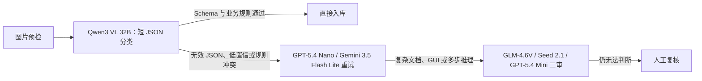

# VLM Price：图片识别模型真实报价与 OpenRouter 实测

把难以理解的“每百万 token 单价”，转换成产品、采购和研发都能直接使用的口径：

> **识别一张 1024×1024、约 1MB、包含单个物品的图片，大约多少钱？**

本项目对 16 个视觉语言模型执行统一图片识别请求，覆盖阿里云、火山引擎、智谱、阶跃星辰、MiniMax、MoonshotAI、OpenAI、Google、Anthropic、Amazon、Meta 与 Mistral 等产品。所有模型使用同一张图、同一字段要求，并记录答案、token、实际账单、供应商、延迟和重试。

数据快照与实测日期：**2026-08-14**。


## 一句话结论

- 正确结果的模型费约为 **¥0.00079～¥0.04588/张**。
- 最低成功价是 Qwen3.7 Flash，但需要放宽输出上限后重试，且耗时 19.84 秒。
- 简单物品识别的综合首选是 Qwen3 VL 32B：约 **¥0.00091/张、4.95 秒**。
- GPT-5.4 Nano 是稳定、快速的备选：约 **¥0.00209/张、3.38 秒**。
- 火山引擎 Seed 2.1 Turbo 识别正确：约 **¥0.00806/张、10.11 秒**；更适合已有方舟技术栈或需要额外推理能力的任务。
- Mistral Small 4 把陶瓷杯高置信度误判为塑料桶，说明低价和高自报置信度都不能代替业务评测。

人民币按固定预算汇率 `$1 = ¥7.20` 换算。

## 完整结果

| 模型 | 结果 | 有效/尝试 | 美元/张 | 人民币/张 | 1千张 | 延迟 | 推荐度 |
|---|---|---:|---:|---:|---:|---:|---:|
| Qwen3.7 Flash | 重试正确 | 1/2 | $0.0001096 | ¥0.00079 | ¥0.79 | 19.84s | ★★★★☆ |
| Qwen3 VL 32B Instruct | 正确 | 1/1 | $0.0001263 | ¥0.00091 | ¥0.91 | 4.95s | ★★★★★ |
| Amazon Nova Lite | 正确 | 1/1 | $0.0001671 | ¥0.00120 | ¥1.20 | 11.99s | ★★★★☆ |
| Mistral Small 4 | **误判** | 1/1 | $0.0002396 | ¥0.00172 | ¥1.72 | 4.92s | ★★☆☆☆ |
| GPT-5.4 Nano | 正确 | 1/1 | $0.0002903 | ¥0.00209 | ¥2.09 | 3.38s | ★★★★★ |
| MiniMax M3 | 正确 | 1/1 | $0.0003086 | ¥0.00222 | ¥2.22 | 4.81s | ★★★★☆ |
| Step 3.7 Flash | 正确 | 1/1 | $0.0003465 | ¥0.00249 | ¥2.49 | 5.70s | ★★★★☆ |
| Gemini 3.5 Flash Lite | 正确 | 1/1 | $0.0004200 | ¥0.00302 | ¥3.02 | 6.95s | ★★★★☆ |
| GLM-4.6V | 正确 | 1/1 | $0.0005285 | ¥0.00381 | ¥3.81 | 8.53s | ★★★★☆ |
| Llama 4 Maverick | 正确 | 1/1 | $0.0007080 | ¥0.00510 | ¥5.10 | 3.76s | ★★★☆☆ |
| GPT-5.4 Mini | 正确 | 1/1 | $0.0010830 | ¥0.00780 | ¥7.80 | 4.12s | ★★★★☆ |
| Seed 2.1 Turbo | 正确 | 1/1 | $0.0011195 | ¥0.00806 | ¥8.06 | 10.11s | ★★★★☆ |
| Claude Haiku 4.5 | 正确 | 1/1 | $0.0016820 | ¥0.01211 | ¥12.11 | 7.71s | ★★★☆☆ |
| GLM-5V Turbo | 重试正确 | 1/2 | $0.0022428 | ¥0.01615 | ¥16.15 | 24.98s | ★★★☆☆ |
| Claude Sonnet 4.6 | 正确 | 1/1 | $0.0046560 | ¥0.03352 | ¥33.52 | 4.20s | ★★★☆☆ |
| Kimi K3 | 正确 | 1/1 | $0.0063726 | ¥0.04588 | ¥45.88 | 13.25s | ★★★☆☆ |

> 这是单张标准商品图的接入与计费冒烟测试，不是通用视觉排行榜。生产选型必须使用带人工真值的业务图片集复测。

## 为什么“1MB 图片”不是计费单位

VLM 通常不会按上传文件的 MB 数线性计费。图片会按照模型各自的缩放、切片或视觉 token 规则转换为输入 token。因此：

- 同为 1024×1024，1MB PNG 与 200KB JPEG 的模型费通常接近；
- 降低压缩体积主要节省传输带宽，不一定减少视觉 token；
- 真正影响费用的是模型、分辨率、视觉 token、输出长度、内部推理 token 和路由供应商；
- 最可靠的成本依据是响应中的 `usage.cost`，而不是只根据目录 token 单价猜测。

以 Qwen3 系列为例，官方图像 token 估算约为：

```text
图像 token ≈ 缩放后高度 × 缩放后宽度 / (32 × 32) + 2
```

1024×1024 理论视觉部分约为 1026 token；本项目 Qwen 实际输入为 1070～1074 token，包含图片和短文本提示，与公式基本吻合。

## 使用热度

OpenRouter 不公开每个模型的独立用户人数，因此项目采用公开 30 日 token 总量作为热度代理。它不等于用户数；未进入每日 Top 50 也不代表无人使用。

数据范围：2026-07-15 至 2026-08-13。

| 模型 | 30 日 OpenRouter token |
|---|---:|
| Step 3.7 Flash | 5.987T |
| Kimi K3 | 5.287T |
| Gemini 3.5 Flash Lite | 572.7B |
| GPT-5.4 Nano | 488.6B |
| GPT-5.4 Mini | 463.0B |
| Qwen3.7 Flash | 202.3B |
| 其余模型 | 未进入或未出现在公开 Top 50 数据 |

引用口径：Source: OpenRouter (openrouter.ai/rankings), as of 2026-08-14T08:03:05.065Z.

## 火山引擎 Seed 的位置

Seed 2.1 Turbo 本次返回正确的 `马克杯 / 红色 / 陶瓷 / 1`：

```text
输入：1384 token
输出：171 token，其中 145 reasoning token
费用：$0.0011195 = ¥0.0080604/张
延迟：10.11 秒
```

它在简单分类上不如 Qwen3 VL 32B 便宜，但如果系统已经使用火山方舟、需要工具调用或更复杂的联合理解，统一平台和工程链路可能比单次模型费更重要。火山方舟按输入/输出 token 计费，图片会转换为输入 token；具体直连单价应以方舟控制台为准，本项目表格记录的是 OpenRouter 实付。

## 成本公式

```text
单张美元 = 输入 token × 输入美元单价/token
         + 输出 token × 输出美元单价/token
         + 按图或按请求附加费

单张人民币 = 单张美元 × 7.20
批量预算 = 单张人民币 × 图片数量
```

示例，Qwen3 VL 32B：

```text
1070 × $0.104 / 1,000,000
+ 36 × $0.416 / 1,000,000
= $0.000126256/张
= ¥0.0009090432/张
≈ ¥0.91/千张
```

## 推荐生产路由



固定类别且有训练样本时，传统分类/检测模型通常比 VLM 更稳定、更容易校准。票据和表格建议采用 OCR/版面分析 → VLM 校验 → 规则引擎，而不是让旗舰 VLM 从头输出全部文字。

## 项目结构

```text
.
├── README.md
├── SECURITY.md
├── assets/
│   └── benchmark-mug-1024.png
├── data/
│   ├── benchmark-results.csv
│   ├── openrouter-model-pricing-snapshot.json
│   └── openrouter-usage-snapshot.json
└── docs/
    ├── 01-完整报价表.md
    ├── 02-交叉验算.md
    ├── 03-测试方法与原始结果.md
    ├── 04-选型与上线建议.md
    └── 05-来源与口径.md
```

## 数据与复核

- [`data/benchmark-results.csv`](data/benchmark-results.csv)：16 个模型的统一结果。
- [`data/openrouter-model-pricing-snapshot.json`](data/openrouter-model-pricing-snapshot.json)：所测模型的当日目录价格快照。
- [`data/openrouter-usage-snapshot.json`](data/openrouter-usage-snapshot.json)：公开排行榜原始数据子集。
- [`docs/01-完整报价表.md`](docs/01-完整报价表.md)：完整报价、效果、延迟与推荐度。
- [`docs/02-交叉验算.md`](docs/02-交叉验算.md)：逐模型 token × 单价复算。
- [`docs/03-测试方法与原始结果.md`](docs/03-测试方法与原始结果.md)：提示词、参数、答案、失败和重试。

## 官方来源

- [OpenRouter Models API](https://openrouter.ai/api/v1/models)
- [OpenRouter Usage Accounting](https://openrouter.ai/docs/cookbook/administration/usage-accounting)
- [OpenRouter 排行榜数据 API](https://openrouter.ai/docs/api/api-reference/datasets/get-rankings-daily)
- [阿里云百炼视觉理解](https://help.aliyun.com/zh/model-studio/vision-model)
- [火山方舟](https://www.volcengine.com/docs/82379/?lang=zh)
- [智谱 GLM-5V Turbo](https://docs.bigmodel.cn/cn/guide/models/vlm/glm-5v-turbo)
- [Kimi API 概览](https://www.kimi.com/help/kimi-api/api-overview)
- [阶跃星辰视觉理解](https://platform.stepfun.com/docs/zh/guides/models/vision)
- [MiniMax 图片理解](https://platform.minimaxi.com/docs/token-plan/mcp-guide)

## 安全与局限

- 仓库不包含任何真实 API key 或 Authorization header；复现实验应从服务端环境变量读取密钥。
- 当前准确性样本只有一张图，适合验证接入与成本，不适合宣布通用模型胜负。
- 延迟取单次请求，会受到路由、排队和冷启动影响。
- 价格、模型版本和供应商可能变化；JSON 快照只代表 2026-08-14。
- `confidence` 是模型自报值，不是校准概率。
- 上线前应使用 200～1000 张业务真值图片评测准确率、关键类别召回率、JSON 合法率、P50/P95 延迟、失败率和重试后总价。

## License

当前仓库尚未指定开源许可证。在添加许可证之前，默认保留所有权利；数据与第三方产品名称仍受其各自条款约束。
